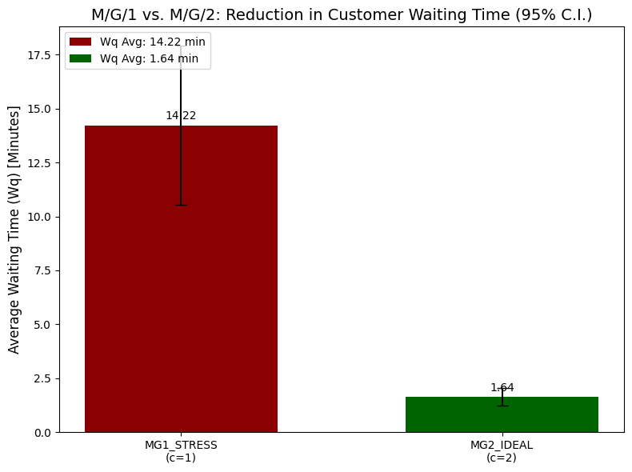

# M/G/c Queueing Simulation: Optimizing Resource Capacity (Technical Logistics)

## Executive Summary

This project simulates a high-demand logistics processing station (M/G/c queue) to find the optimal server capacity. The simulation used 30 independent replications and a rigorous warm-up period to ensure statistically reliable results.

**Key Finding:** Operating with a single server is mathematically unsustainable ($\rho = 103.5\%$). The solution is to add a second server, which delivers a predictable and efficient system.

### Performance Impact

| Metric | M/G/1 Stress (1 Server) | M/G/2 Ideal (2 Servers) | Performance Change |
| :--- | :---: | :---: | :---: |
| **Avg Waiting Time ($W_q$)** | **14.22 min** | **1.64 min** | **88.5% Reduction** |
| **System Stability** | Unstable ($\rho > 1$) | Stable ($\rho < 1$) | **Viable Operation** |

---

## Methodology

The simulation was built in Python using the SimPy library.
* **Arrivals (M):** Exponential Distribution.
* **Service (G):** Realistic Triangular Distribution.

**[Click here to view and run the full statistical notebook on Colab]**
https://colab.research.google.com/drive/1KVuTVkaA12qz2Fu_vaSeteaopN4WI_-k?usp=sharing
